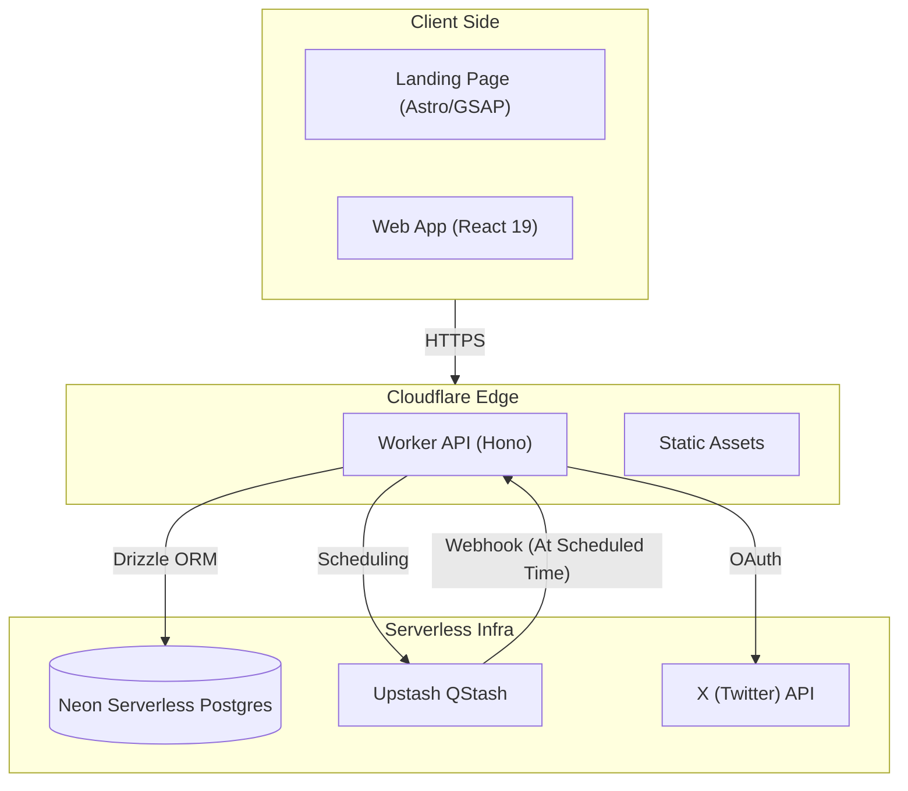

# TweetBatch (TB)

> **The State-of-the-Art Twitter Scheduling Platform**

[](https://workers.cloudflare.com/)
[](https://turbo.build/)
[](https://neon.tech/)
[](https://hono.dev/)
[](https://react.dev/)

TweetBatch (TB) is a high-performance, serverless application designed to streamline your Twitter presence. Built on the edge with Cloudflare, it combines a futuristic UI with robust scheduling capabilities, ensuring your content reaches your audience at the perfect moment.

## 🚀 Live Demos

| Application | URL | Description |
|-------------|-----|-------------|
| **Landing Page** | [Click Here](https://landing-page.fullstackwebdeveloper123.workers.dev) | Marketing site featuring advanced scheduling & interactive feed visualizations. |
| **Web App** | [Click Here](https://tweetbatch-frontend.fullstackwebdeveloper123.workers.dev) | The core application for composing and scheduling tweets. |

---

## 🏗️ System Architecture

TweetBatch leverages a distributed, serverless architecture to ensure instant scalability and zero-maintenance operations.



### Core Components

*   **Scheduling Engine**: Powered by **Upstash QStash**, this system handles precise message delivery with distinct windows (Morning, Afternoon, Evening) to ensure robust throughput without rate limiting.
*   **Interactive Feed (Frontend)**: A drag-and-drop interface built with **React 19**, **TanStack Query**, and **dnd-kit**, allowing users to visually organize their content pipeline.
*   **Database Layer**: Utilizing **Neon Serverless Postgres** with `@neondatabase/serverless` HTTP pooling to manage high-concurrency connections efficiently.
*   **Landing Page Experience**: A high-fidelity site built with **Astro**, **GSAP**, and **Tailwind CSS**, featuring 3D-like animations and scroll-driven storytelling.

---

## 📦 Monorepo Structure

This project is organized as a **Turborepo** to manage multiple applications and shared packages efficiently.

| Path | Package | Description |
|------|---------|-------------|
| `apps/backend` | `api` | Cloudflare Worker handling API requests and QStash webhooks. |
| `apps/frontend` | `web` | Main React application (Vite + TanStack Router). |
| `apps/landing-page` | `landing` | Astro-based static site with advanced animations. |
| `packages/db` | `@repo/db` | Database schema and Drizzle ORM configuration. |
| `packages/ui` | `@repo/ui` | Shared Shadcn UI component library. |
| `packages/auth` | `@repo/auth` | Authentication logic (Lucia/Auth.js). |

---

## ✨ Key Features

*   **Smart Composition**: Rich text editor powered by **TipTap** with character counting and thread support.
*   **Visual Scheduling**: Drag-and-drop calendar view to reorganize your content strategy instantly.
*   **Bulk Import**: Upload hundreds of tweets via JSON/CSV and let the scheduling engine distribute them automatically.
*   **Fault Tolerance**: Built-in Dead Letter Queues (DLQ) and retry mechanisms to handle Twitter API outages gracefully.
*   **Edge Performance**: Deployed to Cloudflare's global network for sub-second latency from anywhere in the world.

---

## 🛠️ Getting Started

### Prerequisites
*   **Bun** (v1.0+)
*   **Node.js** (v20+)
*   **Cloudflare Account**

### Installation

```bash
# Clone the repository
git clone https://github.com/yourusername/tweetbatch.git

# Install dependencies via Bun
bun install

# Set up environment variables
cp .env.example .env
```

### Development

```bash
# Start all applications in development mode
bun run dev

# Filter for specific app
bun run dev --filter=frontend
bun run dev --filter=backend
```

### Database Management

```bash
# Generate migrations
bun run db:generate

# Push changes to Neon
bun run db:push
```

---

## 🎨 Design System

TweetBatch utilizes a custom design system based on **Shadcn UI** and **Tailwind CSS**, featuring a futuristic "Dark Glass" aesthetic.

*   **Typography**: Inter (Body), Outfit (Headings).
*   **Animations**: GSAP for complex timelines, Framer Motion for UI interactions.
*   **Icons**: Lucide React.

---

## 🔒 Security

*   **OAuth 2.0**: Secure authentication with Twitter/X.
*   **Signature Verification**: Webhooks from QStash are cryptographically verified.
*   **Type Safety**: End-to-end type safety with TypeScript and Zod.

---

> Built with ❤️ by [Your Name/Team] using the Cloudflare Stack.
