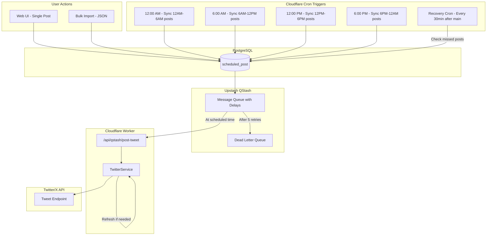
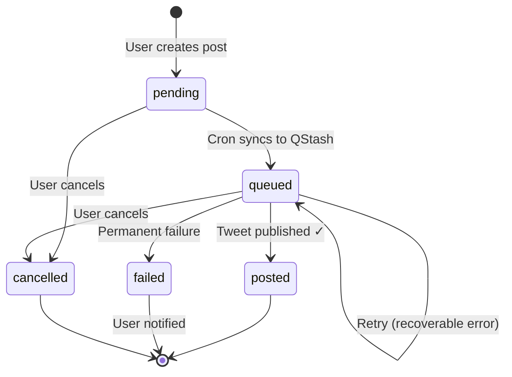
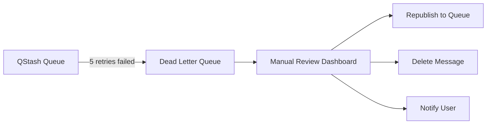
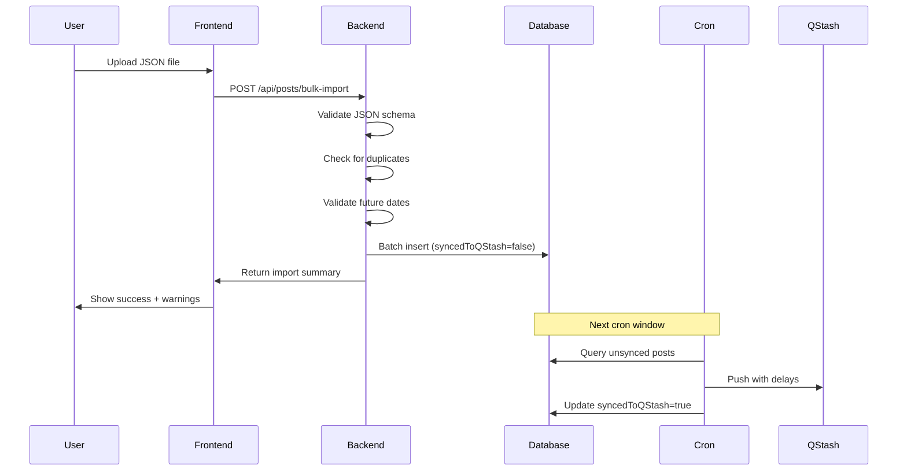

# QStash Bulk Scheduler Architecture

> Technical design document for the Twitter bulk scheduling system using Upstash QStash.

## Overview

This document outlines the architecture for scheduling and posting tweets at specific times using QStash as the scheduling backbone. The system handles bulk imports, token management, failure recovery, and user notifications.

## System Architecture



## Scheduling Strategy: 4-Window Cron

Instead of a single daily cron, we use 4 crons to reduce failure blast radius and eliminate need for buffer windows.

| Cron Time | Window | Posts Synced |
|-----------|--------|--------------|
| 12:00 AM  | 00:00 - 06:00 | Posts scheduled for early morning |
| 6:00 AM   | 06:00 - 12:00 | Posts scheduled for morning |
| 12:00 PM  | 12:00 - 18:00 | Posts scheduled for afternoon |
| 6:00 PM   | 18:00 - 00:00 | Posts scheduled for evening |

### Benefits
- **Max 6-hour delay** between post creation and QStash sync
- **Smaller batches** per cron run (less timeout risk)
- **Built-in redundancy** - if one fails, only 6h window affected
- **No buffer window needed** for edge cases

---

## Database Schema

```sql
CREATE TABLE scheduled_post (
    id TEXT PRIMARY KEY,
    user_id TEXT REFERENCES user(id),
    content TEXT NOT NULL,
    scheduled_at TIMESTAMP NOT NULL,
    
    -- Status: pending → queued → posted/failed/cancelled
    status TEXT DEFAULT 'pending',
    
    -- QStash tracking
    synced_to_qstash BOOLEAN DEFAULT false,
    qstash_message_id TEXT,
    
    -- Result tracking
    tweet_id TEXT,
    error_message TEXT,
    retry_count INTEGER DEFAULT 0,
    
    -- Timestamps
    created_at TIMESTAMP DEFAULT NOW(),
    posted_at TIMESTAMP,
    failed_at TIMESTAMP
);

CREATE INDEX idx_scheduled_post_user ON scheduled_post(user_id);
CREATE INDEX idx_scheduled_post_status ON scheduled_post(status);
CREATE INDEX idx_scheduled_post_scheduled_at ON scheduled_post(scheduled_at);
```

---

## Post Lifecycle



---

## Failure Handling

### Error Classification

| Error Type | Code | Recoverable? | Action |
|------------|------|--------------|--------|
| Unauthorized | 401 | ✅ Yes | Refresh token, retry |
| Forbidden (revoked) | 403 | ❌ No | Mark failed, notify user |
| Rate Limited | 429 | ✅ Yes | Let QStash backoff retry |
| Twitter Server Error | 5xx | ✅ Yes | Let QStash retry |
| Content Rejected | 400 | ❌ No | Mark failed, notify user |
| Network Timeout | - | ✅ Yes | Let QStash retry |

### QStash Retry Configuration

```typescript
await qstash.publishJSON({
    url: "https://api.yourdomain.com/api/qstash/post-tweet",
    body: { postId: "..." },
    retries: 5,
    // Backoff: 10s → 1min → 10min → 1hr → 3hr
});
```

### Dead Letter Queue (DLQ) Workflow



### Recovery Cron

Runs 30 minutes after each main cron to catch any missed posts:

```typescript
// Check for posts that should have been posted but weren't
const missedPosts = await db.query.scheduledPost.findMany({
    where: and(
        lte(scheduledPost.scheduledAt, now),
        eq(scheduledPost.syncedToQStash, true),
        eq(scheduledPost.status, 'pending') // Still pending = missed!
    ),
});
```

---

## API Endpoints

### POST `/api/qstash/post-tweet`

Webhook endpoint called by QStash at scheduled time.

**Headers:**
- `Upstash-Signature`: Verify request is from QStash

**Body:**
```json
{
    "postId": "abc123"
}
```

**Response Codes:**
| Code | Meaning | QStash Action |
|------|---------|---------------|
| 200 | Success or permanent failure | No retry |
| 4xx | Bad request | No retry |
| 5xx | Server error | Retry with backoff |

---

## Bulk Import Flow



### Duplicate Prevention

```typescript
// Create deterministic ID from content + time
const postId = sha256(`${userId}-${content}-${scheduledAt}`).slice(0, 16);

// Use ON CONFLICT DO NOTHING
await db.insert(scheduledPost).values(posts).onConflictDoNothing();
```

---

## User Notifications

### When to Notify

| Event | Notify? | Channel |
|-------|---------|---------|
| Post scheduled | ❌ | - |
| Post published | ⚪ Optional | In-app |
| Retry in progress | ❌ | - |
| Permanent failure | ✅ | Email + In-app |
| Account disconnected | ✅ | Email + In-app |

### Notification Template (Failure)

```
Subject: ⚠️ Scheduled tweet failed to post

Your tweet scheduled for January 25, 2026 at 9:00 AM could not be posted.

Reason: Your Twitter account has been disconnected. Please reconnect.

Content: "Hello world! This is my scheduled..."

[Reconnect Account] [Edit & Reschedule] [Delete]
```

---

## Environment Variables

```env
# QStash
QSTASH_TOKEN=your_qstash_token
QSTASH_CURRENT_SIGNING_KEY=your_signing_key
QSTASH_NEXT_SIGNING_KEY=your_next_signing_key

# Twitter OAuth (for token refresh)
TWITTER_CLIENT_ID=your_client_id
TWITTER_CLIENT_SECRET=your_client_secret

# Backend URL (for QStash webhook)
BACKEND_URL=https://api.yourdomain.com
```

---

## Rate Limiting Considerations

### Twitter API Limits (per user)
- **Free**: 50 tweets/24h
- **Basic**: 100 tweets/day, 3,000/month

### QStash Flow Control

```typescript
// If many tweets for same user, stagger delivery
await qstash.publishJSON({
    url: endpoint,
    body: { postId },
    delay: calculateDelay(postIndex), // Stagger by 1 min each
});
```

---

## Security

### QStash Signature Verification

```typescript
import { Receiver } from "@upstash/qstash";

const receiver = new Receiver({
    currentSigningKey: process.env.QSTASH_CURRENT_SIGNING_KEY,
    nextSigningKey: process.env.QSTASH_NEXT_SIGNING_KEY,
});

app.post("/api/qstash/post-tweet", async (c) => {
    const signature = c.req.header("Upstash-Signature");
    const body = await c.req.text();
    
    const isValid = await receiver.verify({ signature, body });
    if (!isValid) {
        return c.json({ error: "Invalid signature" }, 401);
    }
    
    // Process request...
});
```

---

## Monitoring & Observability

### Key Metrics to Track

1. **Cron success rate** - Did each cron complete?
2. **QStash sync count** - Posts synced per window
3. **Post success rate** - Posted vs failed
4. **Average delay** - Time between scheduled and actual post
5. **DLQ depth** - Messages in dead letter queue

### Recommended Alerts

| Metric | Threshold | Action |
|--------|-----------|--------|
| Cron failure | Any | Page on-call |
| DLQ depth | > 10 | Review failures |
| Post failure rate | > 5% | Investigate |
| Missed posts | > 0 | Run recovery |

---

## Future Enhancements

- [ ] Multi-platform support (LinkedIn, Instagram)
- [ ] Thread scheduling (multiple linked tweets)
- [ ] Media attachments
- [ ] Analytics dashboard
- [ ] User-configurable retry settings
